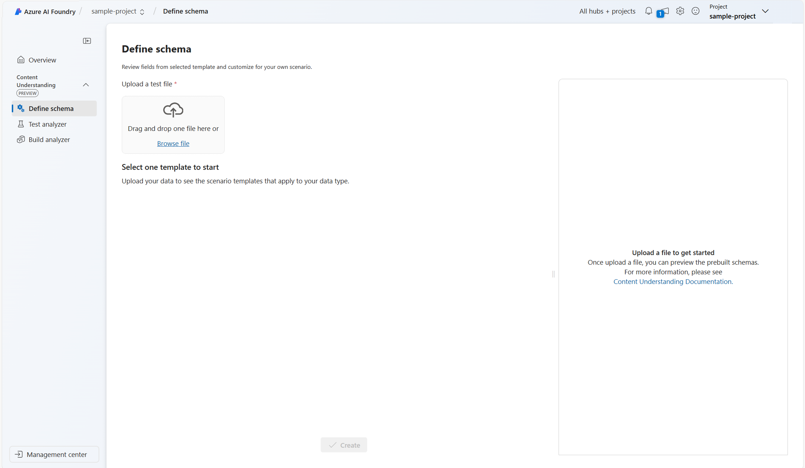
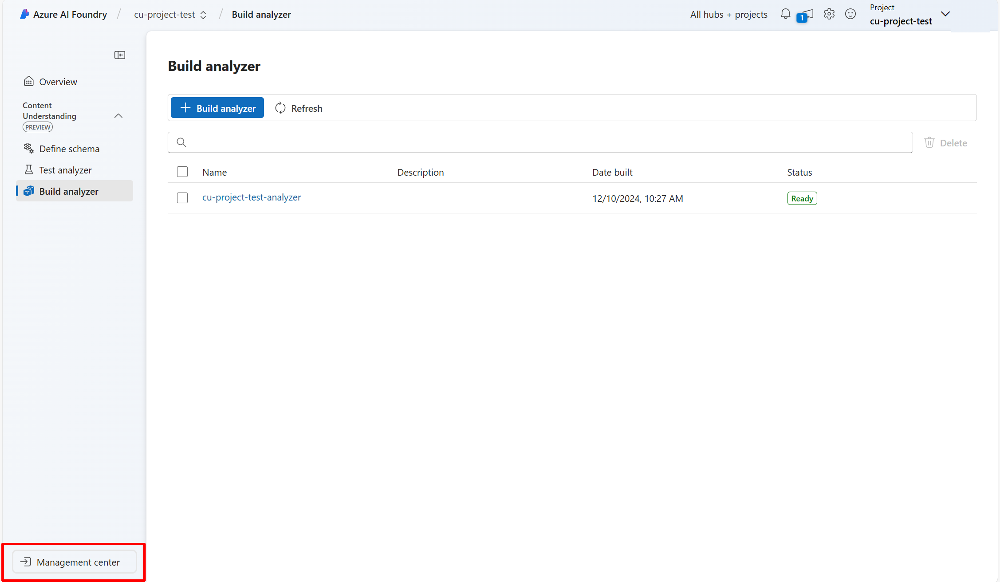
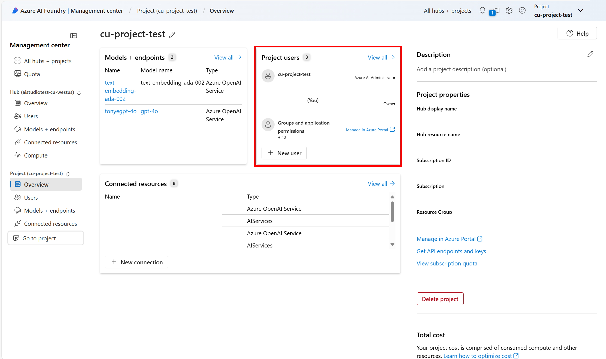

# Create your first Content Understanding project in the AI Foundry

## Step 1: Create a Content Understanding Project

  - Navigate to the [AI Foundry homepage](https://ai.azure.com).

     

  - Select **Create a new Content Understanding Project**.

  

  - In the project creation wizard:
    - Choose the hub you created.
    - Confirm that an AI Services resource and a blob storage container are provisioned (these are selected by default).

  - Complete the setup and click **Create project**.

## Step 2: Build Your First Analyzer

- **Upload a Sample File**: Begin by uploading a sample document (e.g., an invoice).

- **Select an Analyzer Template**: Based on the content type, Azure will suggest relevant analyzer templates. For this example, choose the **Document analysis** template.

- **Define Your Schema**:
    - Add fields such as `vendorName`, `items`, and `price`.
    - Specify the data type for each field (e.g., string, number).
    - Optionally, provide descriptions to clarify each field’s purpose.

- **Save the Schema**: Once your schema is complete, click **Save schema**.

- With the completed schema, Content Understanding now generates the output on your sample data. At this step, you can add more data to test the analyzer's accuracy or make changes to the schema if needed.

- **Build the Analyzer**: Click **Build analyzer** to generate your custom analyzer. The process may take a few moments. Once complete, you’ll receive a unique **Analyzer ID**.

> 🧪 Use this ID to test your analyzer or integrate it into applications via API.

## Step 3: Share and Manage Access

To manage access to your Content Understanding project:

- Navigate to the **Management Center** located at the bottom of your project's navigation pane.

- Here, you can:
    - Add or remove users.
    - Assign roles to users to control their level of access.

*Image: Management Center interface*  

## Next Steps

Now that you've created your first analyzer, consider the following:

- **Test the Analyzer**: Upload additional sample documents to evaluate the accuracy and performance of your analyzer.
- **Integrate with Applications**: Use the generated analyzer ID to call your analyzer via the REST API in your applications.
- **Explore More Templates**: The Azure AI Foundry offers a variety of analyzer templates for different content types. Explore these to find solutions tailored to your needs.

For more detailed information and advanced configurations, refer to the official [Azure AI Content Understanding documentation](https://learn.microsoft.com/en-us/azure/ai-services/content-understanding/quickstart/use-ai-foundry).

---

