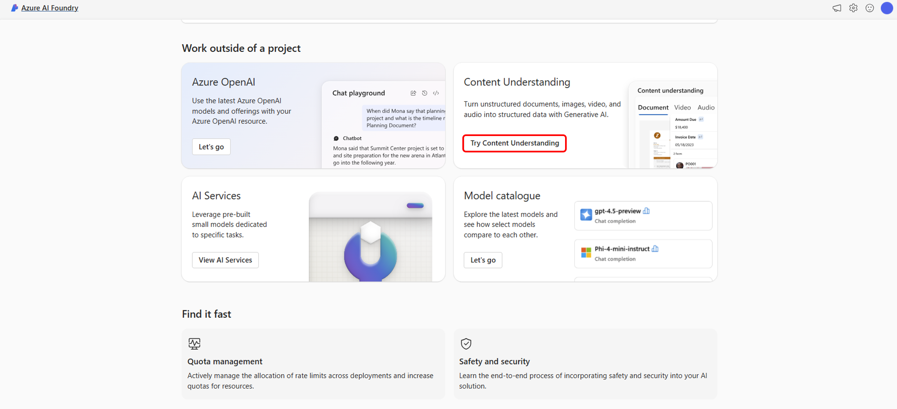
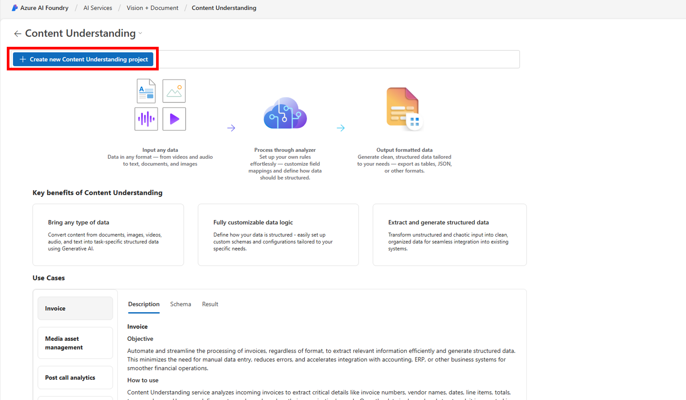
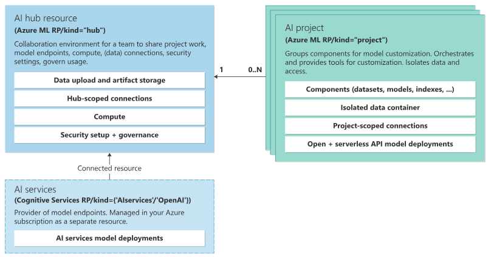

# Create your first Content Understanding project in the AI Foundry

## Step 1: Create a Content Understanding Project

  - Navigate to the [AI Foundry homepage](https://ai.azure.com).

     

  - Select **Create a new Content Understanding Project**.

  

  - In the project creation wizard:
    - Choose the hub you created.
    - Confirm that an AI Services resource and a blob storage container are provisioned (these are selected by default).

  - Complete the setup and click **Create project**.

## Step 2: Build Your First Analyzer

1. **Upload a Sample File**: Begin by uploading an **audio (.mp3, .wav)** or **video (.mp4, .mov)** file. This file will be used to train your custom analyzer.

> 🎥💡 Tip: Choose a file that contains structured spoken content (like an interview, podcast, or recorded meeting) to get the best results.

2. **Select an Analyzer Template**: Based on the content type, Azure will suggest relevant analyzer templates. For this example, choose the **Document analysis** template.

3. **Define Your Schema**:
   - Add fields such as `speakerName`, `topic`, `timestamp`, or any entities relevant to your audio/video.
   - Specify the data type for each field (e.g., string, number, datetime).
   - Optionally, provide descriptions to clarify each field’s purpose.

4. **Save the Schema**: Once your schema is complete, click **Save schema**.

5. **Build the Analyzer**: Click **Build analyzer** to generate your custom analyzer. The process may take a few moments. Once complete, you’ll receive a unique **Analyzer ID**.

> 🧪 Use this ID to test your analyzer or integrate it into applications via API.

## Step 3: Share and Manage Access

To manage access to your Content Understanding project:

1. Navigate to the **Management Center** located at the bottom of your project's navigation pane.
2. Here, you can:
   - Add or remove users.
   - Assign roles to users to control their level of access.

*Image: Management Center interface*  

## Next Steps

Now that you've created your first analyzer, consider the following:

- **Test the Analyzer**: Upload additional sample documents to evaluate the accuracy and performance of your analyzer.
- **Integrate with Applications**: Use the generated analyzer ID to call your analyzer via the REST API in your applications.
- **Explore More Templates**: The Azure AI Foundry offers a variety of analyzer templates for different content types. Explore these to find solutions tailored to your needs.

*Image: Analyzer testing interface*  

For more detailed information and advanced configurations, refer to the official [Azure AI Content Understanding documentation](https://learn.microsoft.com/en-us/azure/ai-services/content-understanding/quickstart/use-ai-foundry).

---

