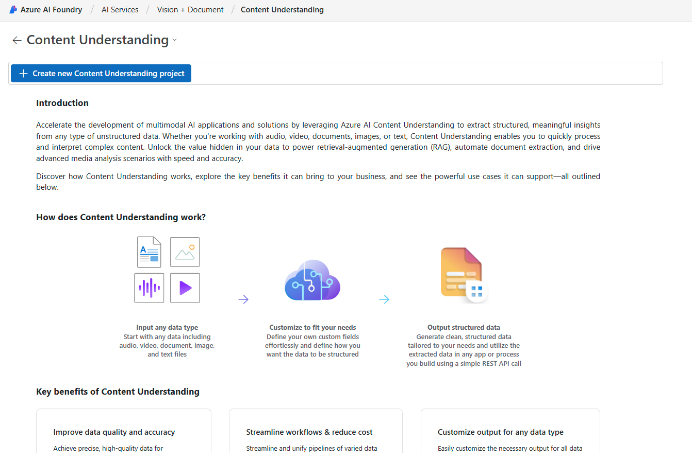

# Create your first Content Understanding project in the AI Foundry

## Step 1: Create a Content Understanding Project

- Navigate to the [AI Foundry homepage](https://ai.azure.com) and select content understanding.

     

- Select **Create a new Content Understanding Project** and provide your project a name (i.e. call_analyzer).

  

- Select Browse file to upload the [sample audio file](../data/convo_2c703f97-6657-4a15-b8b2-db6b96630b2d_2024-12-06%2006_00_00.wav).

  

- Select the Post call analytics template and select create. 
  

- Save the default schema 
  

- Select Run analysis  
  

- Select the Results to view the JSON output.
  
 

For more detailed information and advanced configurations, refer to the official [Azure AI Content Understanding documentation](https://learn.microsoft.com/en-us/azure/ai-services/content-understanding/quickstart/use-ai-foundry).

